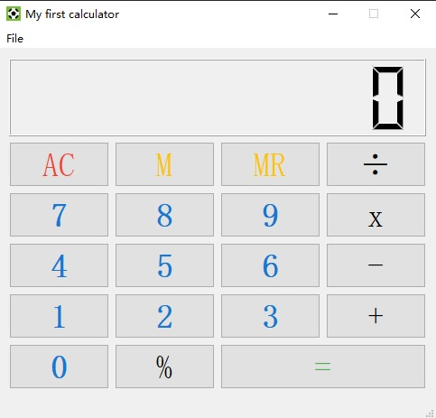

# A desktop calculator in PyQt

A simple calculator application implemented in Python using PyQt. The UI was designed in Qt Designer,the calculator operations are implemented using simple stack-based logic.

